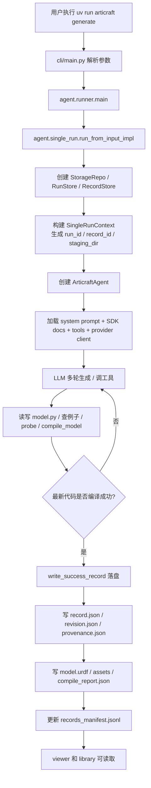
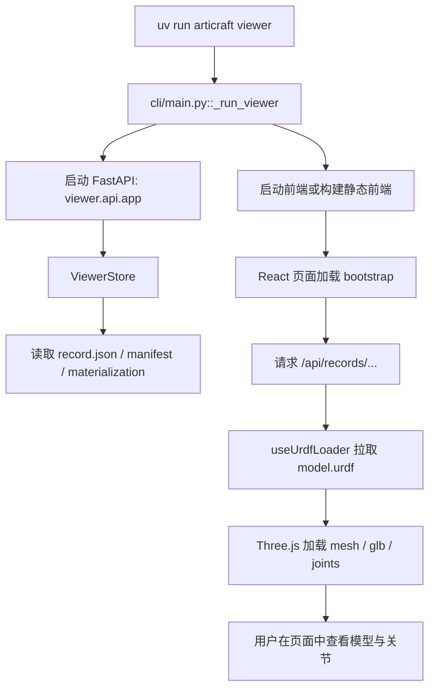

# Articraft 项目代码运行全解（中文）

## 1. 项目一句话说明

Articraft 是一个“用大模型写 `model.py`，再把它编译成可查看的关节式 3D 资产”的本地优先系统。

它的核心闭环是：

1. 用户通过 CLI 输入文本提示词。
2. `agent/` 驱动大模型多轮调用工具，逐步生成和修改 `model.py`。
3. `agent/compiler.py` 执行这个 Python 模型脚本，导出 URDF 和几何资产。
4. `storage/` 把记录、版本、成本、trace、编译产物写入本地 `data/`。
5. `viewer/api` + `viewer/web` 读取这些产物，在浏览器中显示模型、关节和元数据。

---

## 2. 先看整体架构

| 模块 | 目录 | 作用 | 关键入口 |
| --- | --- | --- | --- |
| CLI 层 | `cli/` | 接收命令，路由到生成、编译、viewer、library | `cli/main.py` |
| Agent 运行层 | `agent/` | 调大模型、执行工具、编译反馈、多轮迭代 | `agent/harness.py`、`agent/single_run.py` |
| Prompt/工具层 | `agent/prompts/`、`agent/tools/` | 组装 system prompt、SDK 文档、工具集 | `agent/prompts/loader.py`、`agent/tools/__init__.py` |
| Provider 层 | `agent/providers/` | 屏蔽 OpenAI/Gemini/Anthropic/Codex CLI 等差异 | `agent/providers/factory.py` |
| 编译层 | `agent/compiler.py` | 执行 `model.py`，运行测试，导出 URDF/mesh/glb | `compile_urdf_report()` |
| SDK 层 | `sdk/`、`sdk/_core/` | 定义 `ArticulatedObject`、Part、Joint、导出规则、几何工具 | `sdk/_core/v0/_urdf_export.py` |
| 存储层 | `storage/` | 定义 `data/` 布局、record、revision、manifest、materialization | `storage/layout.py`、`storage/records.py` |
| Viewer API | `viewer/api/` | 读取 record、编译产物、统计信息，对前端暴露 API | `viewer/api/app.py` |
| Viewer Web | `viewer/web/` | React + Three.js 显示 URDF、mesh、关节控制、代码面板 | `viewer/web/src/ViewerShell.tsx` |
| 测试层 | `tests/` | 覆盖 provider、prompt、storage、sdk、viewer API 等 | `tests/` |

---

## 3. 核心运行流程图

### 3.1 `articraft generate` 主流程



### 3.2 Viewer 读取流程



---

## 4. 从入口开始拆代码

## 4.1 CLI 是总入口

入口是 `pyproject.toml` 里的：

```toml
[project.scripts]
articraft = "cli.main:main"
```

也就是说执行 `uv run articraft ...` 时，会进入 `cli/main.py`。

### `cli/main.py` 做了什么

它负责三件事：

| 动作 | 具体行为 |
| --- | --- |
| 参数解析 | 定义 `generate`、`draft`、`rerun`、`fork`、`compile`、`viewer`、`library`、`external` 等子命令 |
| 环境加载 | `load_repo_env(args.repo_root)` 读取 `.env` |
| 命令分发 | 把命令路由到 `agent`、`storage`、`viewer` 等模块 |

最重要的几个命令：

| 命令 | 实际走向 |
| --- | --- |
| `generate` | `_run_generate()` -> `agent_runner.main(argv)` |
| `draft` | `_run_draft()` -> `create_draft_record()` |
| `rerun` | `_run_rerun()` -> `rerun_record_in_place()` |
| `fork` | `_run_fork()` -> `edit_record()` |
| `compile` | `_run_compile()` -> `cli/compile_record.py` |
| `viewer` | `_run_viewer()` -> 启动 FastAPI + 前端 |
| `library` | `_run_library()` -> rebuild/list/check/delete/set-category |

---

## 4.2 本地数据仓库先被建立起来

所有命令几乎都会先构造 `StorageRepo`。

### `storage/layout.py`

这个文件定义了整套 `data/` 目录规范，例如：

| 路径 | 含义 |
| --- | --- |
| `data/records/` | 所有 record 的根目录 |
| `data/records/<record_id>/record.json` | 当前 record 的摘要元数据 |
| `data/records/<record_id>/revisions/<rev>/model.py` | 某个版本的真实模型代码 |
| `data/cache/record_materialization/<record_id>/model.urdf` | 编译后 URDF |
| `data/cache/record_materialization/<record_id>/assets/` | 编译后 mesh/glb/viewer 资产 |
| `data/records_manifest.jsonl` | library 浏览时的清单 |
| `data/cache/runs/<run_id>/` | 某次运行的元数据、结果、staging 区 |

### `storage/repo.py`

这是一个很薄的文件仓库封装：

| 方法 | 作用 |
| --- | --- |
| `ensure_layout()` | 确保 `data/` 下必要目录存在 |
| `read_json()` | 读取 JSON 文件 |
| `write_json()` | 写 JSON 文件 |
| `write_text()` | 写文本文件 |

它本身不复杂，但非常关键，因为整个项目的“真实状态”都在这个本地目录树里。

---

## 5. 一次 `generate` 到底怎么跑

## 5.1 先把运行上下文准备好

`agent/single_run.py` 是单条生成任务的主编排器。

### `run_from_input_impl()`

它做这些事情：

1. 创建 `StorageRepo`。
2. 创建 `RecordStore`、`RunStore`。
3. 调 `execute_single_run()` 进入真正执行阶段。

### `agent/run_context.py::_build_single_run_context()`

这里生成本次运行的所有关键路径：

| 字段 | 作用 |
| --- | --- |
| `run_id` | 当前这次生成的运行 ID |
| `record_id` | 将来要保存的对象记录 ID |
| `revision_id` | 当前版本号，默认 `rev_000001` |
| `staging_dir` | 临时工作目录，大模型先在这里写 `model.py` |
| `script_path` | staging 区里的 `model.py` |
| `cost_path` | 本次运行的成本统计 |
| `trace_dir` | 对话和工具调用 trace |
| `record_*` | 最终要保存到 record 的路径 |

这个设计很重要：先在 staging 区工作，成功后再正式落库，避免半成品污染正式记录。

---

## 5.2 创建 `ArticraftAgent`

`execute_single_run()` 会实例化 `agent/harness.py` 里的 `ArticraftAgent`。

### 它初始化时做了什么

| 步骤 | 细节 |
| --- | --- |
| 规范 provider | 用 `normalize_provider_name()` 统一 provider 名称 |
| 创建 provider client | 通过 `agent/providers/factory.py::create_provider_client()` 选择 OpenAI/Gemini/Anthropic/Codex CLI 等 |
| 创建工具注册表 | `build_tool_registry()` 组装本次 provider 可用工具 |
| 创建编译反馈循环 | `CompileFeedbackLoop` 负责 `compile_model` 的成功/失败反馈 |
| 创建 guidance 注入器 | 自动在失败时补充“你应该如何修”提示 |
| 加载 system prompt | 从 `agent/prompts/generated/*.txt` 读取对应 provider 版本提示词 |
| 加载 SDK 文档 | `build_virtual_workspace()` 把 `model.py` 和 SDK 文档虚拟成只读工作区 |
| 建立成本追踪 | `CostTracker` 统计 token 和美元成本 |
| 建立 TUI | `SingleRunDisplay` 负责终端显示每一轮情况 |

### 为什么要把 SDK 文档做成虚拟工作区

因为这个系统不是直接把所有 SDK 文档一次性塞给模型，而是：

1. 预加载最核心的 quickstart / probe / testing 文档。
2. 让模型通过 `read_file(path="docs/...")` 在需要时再读取精确文档。

这样可以减少上下文长度，同时保留精确引用能力。

---

## 5.3 首轮消息怎么构造

`agent/tools/__init__.py` 里有两个关键函数：

| 函数 | 作用 |
| --- | --- |
| `build_initial_user_content()` | 把文本 prompt 和可选图片组合成输入内容 |
| `build_first_turn_messages()` | 在用户提示前面插入 SDK 文档和运行时指导 |

运行时指导会明确要求模型：

1. 先读当前 `model.py`。
2. 修改后必须跑 `compile_model`。
3. 编译成功且符合要求后再结束。

这就是为什么 Articraft 比普通“直接让模型写代码”的流程更稳定，它把操作约束写进了 agent 循环里。

---

## 5.4 大模型主循环如何工作

主循环在 `ArticraftAgent.run()`。

### 其运行步骤表

| 阶段 | 具体操作 | 关键代码 |
| --- | --- | --- |
| 准备代码文件 | 如果 `model.py` 为空，就用 scaffold 初始化 | `_ensure_code_file()` |
| 发起 LLM 请求 | 调 `self.llm.generate_with_tools()` | `run()` |
| 解析回复 | 抽取 text、tool_calls、usage、thinking | `MessageCodec` |
| 记录成本 | 记 token、美元成本、上下文压力 | `CostTracker` |
| 执行工具 | 逐个或并行执行 tool call | `_execute_tool_calls_batch()` |
| 注入纠错 guidance | 编译失败/工具失败后追加额外提示 | `_maybe_inject_*_guidance()` |
| 判断结束 | 最新代码必须 fresh compile success 才允许结束 | `_handle_finish_attempt()` |
| 超限保护 | 成本超限、无动作多轮、超过 max_turns 都会中止 | `run()` |

### Agent 可用工具

工具集合由 provider 决定，但核心是这些：

| 工具 | 作用 |
| --- | --- |
| `read_file` | 读 `model.py` 或虚拟 SDK 文档 |
| `apply_patch` / `replace` / `write_file` | 改代码 |
| `compile_model` | 编译当前 `model.py` |
| `probe_model` | 探查模型状态、辅助分析 |
| `find_examples` | 在 `sdk/_examples/` 里检索参考例子 |

OpenAI provider 默认更偏向 `read_file + apply_patch + compile_model`；
Codex CLI provider 还会带 `replace` 和 `write_file`。

---

## 5.5 `compile_model` 不是简单语法检查，而是真编译

这是 Articraft 的核心价值。

`compile_model` 最终会走到 `agent/compiler.py` 里的 `compile_urdf_report()`。

### 编译阶段到底做了什么

| 阶段 | 操作 |
| --- | --- |
| 执行脚本 | 运行生成出的 `model.py` |
| 读取导出对象 | 找到脚本里的 `object_model` |
| 跑测试 | 调用作者定义的 `run_tests()`，再补跑编译器自带 baseline checks |
| 处理精确碰撞 | `compile_object_model_with_exact_collisions()` 计算更精确的碰撞几何 |
| 导出 URDF | `sdk/_core/v0/_urdf_export.py::compile_object_to_urdf_xml()` |
| 生成警告 | 把几何质量、重叠、孤立部件等问题转成 warning/signal bundle |

### 这里为什么能导出 URDF

因为 `model.py` 生成的不是普通字符串，而是一个 SDK 对象：

```python
object_model = build_object_model()
```

这个 `object_model` 是 `ArticulatedObject`，它包含：

1. `parts`
2. `articulations`
3. `materials`
4. collisions / visuals / inertial 等结构

`_urdf_export.py` 会把这些对象逐个翻译成 `<robot>`、`<link>`、`<joint>`、`<visual>`、`<collision>` 等 XML 节点。

---

## 6. SDK 层在这个项目里扮演什么角色

SDK 不是“附属工具”，而是整个项目的领域模型。

## 6.1 `sdk/` 的职责

| 模块 | 职责 |
| --- | --- |
| `sdk/__init__.py` | 导出公共 API |
| `sdk/_core/v0/` | 真正的数据结构、导出器、碰撞、几何检查 |
| `sdk/_extensions/cadquery/` | CadQuery 扩展 |
| `sdk/_docs/` | 给 agent 读的 SDK 文档 |
| `sdk/_examples/` | 给 agent 检索的参考模型 |

## 6.2 生成代码为什么最终都围绕 `object_model`

因为这个系统要求产出的是“可执行的参数化 3D 建模代码”，不是最终文本描述。

模型脚本大致遵循这种形态：

```python
def build_object_model() -> ArticulatedObject:
    ...
    return model

def run_tests() -> TestReport:
    ...
    return ctx.report()

object_model = build_object_model()
```

所以：

1. `build_object_model()` 负责真实几何和关节结构。
2. `run_tests()` 负责验证“这个模型是否真的符合提示词要求”。
3. 编译器读取 `object_model` 并导出 URDF。

---

## 7. 成功后如何落盘成正式 record

成功落盘逻辑在 `agent/record_persistence.py::write_success_record()`。

### 它做了哪些事情

| 步骤 | 具体行为 |
| --- | --- |
| 写主文件 | 保存 `prompt.txt`、`model.py`、`model.urdf` |
| 保存输入图 | 如果有图片提示，把输入图拷贝到 `inputs/` |
| 保存成本 | 从 staging 复制 `cost.json` |
| 保存 trace | 从 staging 复制 `traces/` |
| 保存材质/网格 | 从 staging 的 `assets/` 复制到 materialization 区 |
| 写编译报告 | 生成 `compile_report.json` |
| 写 provenance | 保存 provider、model、thinking、系统 prompt、环境信息 |
| 写 revision metadata | 生成 `revisions/<rev>/revision.json` |
| 写 record metadata | 更新 `record.json` |
| 更新 manifest | 通过 `RecordStore.write_record()` 自动 upsert 到 `records_manifest.jsonl` |

### 成功后一个 record 的典型结构

```text
data/
  records/
    rec_xxx/
      record.json
      revisions/
        rev_000001/
          prompt.txt
          model.py
          provenance.json
          revision.json
          cost.json
          inputs/
          traces/
  cache/
    record_materialization/
      rec_xxx/
        model.urdf
        compile_report.json
        assets/
          meshes/
          glb/
          viewer/
  records_manifest.jsonl
```

### 这些文件分别给谁用

| 文件 | 消费者 |
| --- | --- |
| `record.json` | library、viewer 列表页 |
| `prompt.txt` | rerun、fork、人工审阅 |
| `model.py` | compile、rerun、fork、代码查看 |
| `provenance.json` | 复现实验、显示模型来源 |
| `revision.json` | 版本历史 |
| `cost.json` | 成本统计 |
| `traces/` | 调试 agent 行为 |
| `model.urdf` | viewer 3D 加载 |
| `assets/meshes`/`glb` | viewer 真正的几何资源 |
| `records_manifest.jsonl` | 快速浏览列表 |

---

## 8. `draft`、`rerun`、`fork` 和 `external` 的差异

| 命令 | 本质 | 代码路径 | 使用场景 |
| --- | --- | --- | --- |
| `draft` | 只建 record 骨架，不跑模型 | `create_draft_record()` | 先手工写模型 |
| `generate` | 从零开始生成 | `run_from_input()` | 新建对象 |
| `rerun` | 在同一个 record 下新建 revision 重新生成 | `rerun_record_in_place()` | 想重跑当前对象 |
| `fork` | 基于父 record 复制出一个新 record 再编辑 | `edit_record()` | 在旧对象基础上做变体 |
| `external` | 为外部 agent 创建草稿/收尾 | `cli/external.py` | 用 Codex/Claude/Cursor 离线写数据 |

### `fork` 的关键点

`agent/edit.py` 会：

1. 读取父 record 的 `model.py`、`prompt.txt`、`provenance.json`。
2. 把父模型代码复制到新的 staging 里。
3. 给大模型一段“这是编辑任务，请尽量小改”的运行时提示。
4. 最终把它保存为一个新的 record，并写 lineage。

### `rerun` 的关键点

`agent/rerun.py` 会：

1. 读取已有 record 的原始 prompt 和 provenance。
2. 自动推回原来的 provider/model/thinking 配置。
3. 生成新的 revision，如 `rev_000002`。
4. 在同一个 `record_id` 下覆盖 active revision。

---

## 9. Viewer 是怎么把 record 变成可视化页面的

## 9.1 FastAPI 端

`viewer/api/app.py` 会构建 `FastAPI` 应用，并注入一个 `ViewerStore`。

### `ViewerStore` 拆成多个子仓库

| 子模块 | 作用 |
| --- | --- |
| `materialization` | 编译 record，检查和复制资产 |
| `records` | 读取 record、历史、详情 |
| `search` | 浏览、过滤、搜索 |
| `runs` | 读取 run 和 staging 信息 |
| `stats` | 统计库状态 |
| `mutations` | 删除 record / staging 等操作 |

### 常用 API

| API | 作用 |
| --- | --- |
| `/api/bootstrap` | viewer 启动时需要的初始信息 |
| `/api/stats` | 统计库记录数等 |
| `/api/records/browse` | 列表页浏览和筛选 |
| `/api/records/{id}/summary` | 单 record 摘要 |
| `/api/records/{id}/history` | revision 历史 |
| `/api/records/{id}/files/...` | 查看源文件 |
| `/api/runs/{id}` | 查看一次运行的详情 |

---

## 9.2 前端端

前端根组件是 `viewer/web/src/App.tsx`，真正主页面在 `ViewerShell.tsx`。

### `ViewerShell.tsx` 在做什么

| 区域 | 作用 |
| --- | --- |
| Sidebar | 浏览 record、筛选、切换 run |
| Viewport | 3D 视口 |
| Inspector | 展示 metadata、代码、trace、joint、渲染选项 |

### URDF 加载核心在 `useUrdfLoader.ts`

它会：

1. 请求 `{baseFileUrl}/model.urdf`
2. 解析 URDF
3. 把 mesh 路径改写为前端可访问路径
4. 用 Three.js 构建 scene graph
5. 加载 visual mesh / collision mesh
6. 自动 fit camera、同步关节控制

所以 viewer 其实不是直接解释 Python，而是读取 Python 编译后的 URDF + 资产。

---

## 10. 你读这个项目时，最值得抓住的“核心逻辑”

可以把整个项目理解成 4 层：

| 层 | 核心问题 | Articraft 的回答 |
| --- | --- | --- |
| 生成层 | 模型代码怎么写出来 | 让 LLM 通过工具多轮改 `model.py` |
| 验证层 | 怎么知道它不是瞎写 | 每轮强制 `compile_model`，跑 tests 和几何 QC |
| 存储层 | 怎么让结果可复现 | record/revision/provenance/materialization 全部落盘 |
| 浏览层 | 怎么让人检查结果 | 用 viewer 读取 URDF、mesh、trace、metadata |

真正最核心的设计，不是某个数学函数，而是这个闭环：

`提示词 -> 代码 -> 编译 -> 反馈 -> 再改代码 -> 成功后持久化 -> viewer 检查`

这也是 Articraft 和“直接让大模型吐一段 3D 代码”的最大不同。

---

## 11. 如何使用这个项目

## 11.1 环境准备

```bash
uv sync --group dev
just setup
```

如果只想最小启动，也可以：

```bash
uv run articraft init
uv run articraft env bootstrap
```

然后在 `.env` 中设置至少一个 provider 的 key，例如：

```bash
OPENAI_API_KEY=...
GEMINI_API_KEY=...
ANTHROPIC_API_KEY=...
```

---

## 11.2 最常用的命令

### 1. 初始化本地数据目录

```bash
uv run articraft init
```

### 2. 查看本地状态

```bash
uv run articraft status
uv run articraft library status
```

### 3. 生成一个新对象

```bash
uv run articraft generate "Create a realistic articulated desk lamp with a weighted base, two hinged arms, and an adjustable lamp head."
```

### 4. 带图片生成

```bash
uv run articraft generate --image reference.png "Create a compact desk fan with adjustable tilt."
```

### 5. 只创建草稿，不运行生成

```bash
uv run articraft draft "Create a mechanical clamp lamp"
```

### 6. 重跑已有对象

```bash
uv run articraft rerun <record_id>
```

### 7. 基于旧对象派生新对象

```bash
uv run articraft fork <record_id> "make the handle longer"
```

### 8. 手工重新编译某个对象

```bash
uv run articraft compile <record_id>
uv run articraft compile <record_id> --target visual
uv run articraft compile <record_id> --validate
```

### 9. 打开 viewer

```bash
just viewer
```

开发模式：

```bash
just viewer-dev
```

### 10. 查看本地库

```bash
uv run articraft library list
uv run articraft library rebuild-manifest
uv run articraft library check --require-records
```

---

## 11.3 如果你想用外部 AI agent 写数据

仓库已经明确要求走 `external` 流程，不要手工乱造 record 目录。

### 创建外部 agent 草稿

```bash
uv run articraft external init "Create a realistic articulated desk lamp" --agent codex
```

### 完成后收尾

```bash
uv run articraft external finalize <record_id>
```

这套流程的规则写在仓库根目录的 `EXTERNAL_AGENT_DATA.md`。

---

## 12. 推荐的源码阅读顺序

如果你想自己继续深入，建议按这个顺序读：

1. `cli/main.py`
2. `agent/single_run.py`
3. `agent/harness.py`
4. `agent/tools/__init__.py`
5. `agent/compiler.py`
6. `agent/record_persistence.py`
7. `storage/layout.py`
8. `storage/models.py`
9. `viewer/api/app.py`
10. `viewer/web/src/ViewerShell.tsx`
11. `viewer/web/src/components/viewer3d/useUrdfLoader.ts`
12. `sdk/_core/v0/_urdf_export.py`

按这个顺序，你会先抓住“控制流”，再进入“数据结构”和“渲染细节”。

---

## 13. 一句话总结

Articraft 的核心不是单纯生成 3D 模型，而是把“3D 资产生成”变成一个可验证、可回放、可版本化、可浏览的代码生产流水线。

最关键的代码链路是：

`cli/main.py -> agent/single_run.py -> agent/harness.py -> agent/compiler.py -> agent/record_persistence.py -> viewer/api -> viewer/web`

